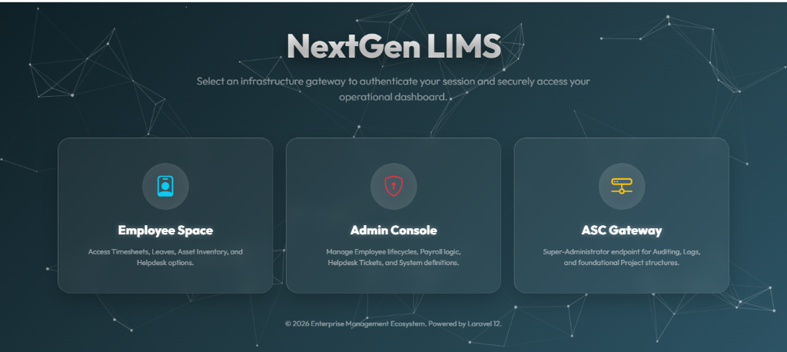
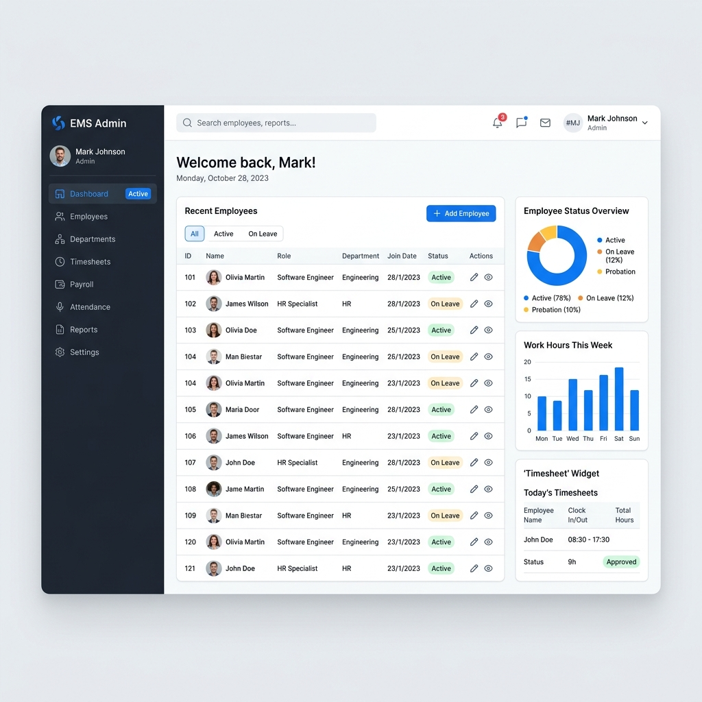
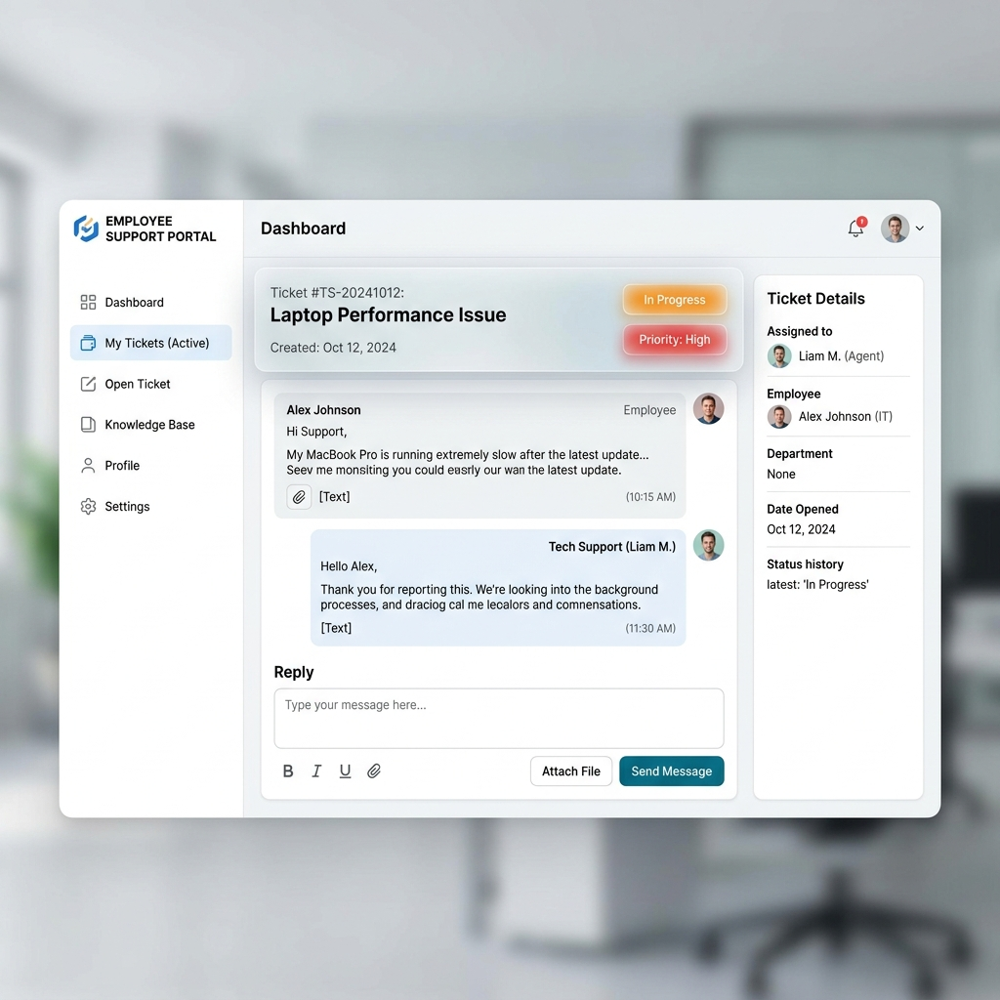

<div align="center">
  
  <h1>Employee Management System (EMS)</h1>
  <p>A comprehensive, feature-rich HR & Employee Portal built on Laravel 12.</p>
</div>

---

## 📖 Overview
The **Employee Management System** is a robust web application designed to streamline HR operations, boost corporate discipline, and simplify intra-company communication. Built using **Laravel 12 (PHP 8.2)**, this system handles everything from attendance tracking to advanced technical workflows.

### 🖼️ System Interface Peeks

<div align="center">
  
  <br><i>Secure Infrastructure Gateway (Admin, Employee & ASC)</i><br><br>

  
  <br><i>Company Administrative Super-Dashboard</i><br><br>
  
  
  <br><i>Internal Threaded Helpdesk Interface</i>
</div>

---

### 🏢 Key Modules Developed

1. **Authentication & Multi-Role Architecture**
   - Secure portals for **Administrators** (HR/Management), **Employees**, and **Super Admins** (ASC).
   - Custom Middleware routing to ensure absolute Data Privacy.

2. **Timesheets & Leave Management**
   - Live daily clock-in/clock-out tracking.
   - Comprehensive dynamic Leaves calendar handling approval/rejection pipelines.
   - Automated "upcoming birthday & holiday" widgets on employee dashboards.

3. **Performance Appraisals (KPIs)**
   - Custom review cycles for management.
   - Self-evaluation submissions for employees and graded feedback matrix.

4. **Internal Helpdesk Ticketing System**
   - Priority-based support requests categorized by IT, HR, and Facility.
   - Live threaded chat system between employees and management for quick resolution.

5. **Payroll, Expenses, & Payslips**
   - Dynamically generated employee monthly Payslips (PDF format support built-in).
   - "Expense Claims" pipeline for reimbursing travel/business costs.

6. **Daily Work EOD Reporting**
   - Mandatory End-Of-Day workflow for employees to log completed tasks, tomorrow's plan, and blockers.
   - Integrated HR Verification button to acknowledge daily reports visually.

7. **Project & Task Management**
   - Kanban-style task allocation.
   - Assign internal tasks to multiple colleagues and track their progress live.

8. **Recruitment & Interview Scheduling**
   - Advanced Candidate and external Interview recording subsystem.

9. **HR Subsystems (Offboarding/Perks)**
   - T-Shirt Inventory assigning.
   - Parking Card management system.

## 🛠️ Technology Stack
- **Backend:** Laravel 12.x, PHP 8.2+
- **Database:** MySQL / SQLite
- **Frontend Layer:** Blade Templating Engine, Bootstrap 5, Vanilla CSS
- **Interactions:** SweetAlert2 (Toast notifications) & dynamic DOM manipulation.

## 🚀 Installation & Setup

Clone the repository and run the setup commands in your terminal:

```bash
# 1. Clone repository
git clone https://github.com/brijesh-vaghasiya/employee-management-laravel.git

# 2. Enter directory
cd employee-management-laravel

# 3. Install PHP Dependencies
composer install

# 4. Configure Environment
cp .env.example .env
php artisan key:generate

# 5. Run Database Migrations & Seeds
php artisan migrate --seed

# 6. Start the Local Development Server
php artisan serve
```

## 🔒 Security Implementations
- Built-in **CSRF** form protection on all endpoints.
- Strict Eloquent relationship scoping (e.g. `Auth::user()->employee->tasks`) to prevent manual URL manipulation vulnerabilities.

---
*Built with ❤️ utilizing modern Laravel ecosystem practices.*
